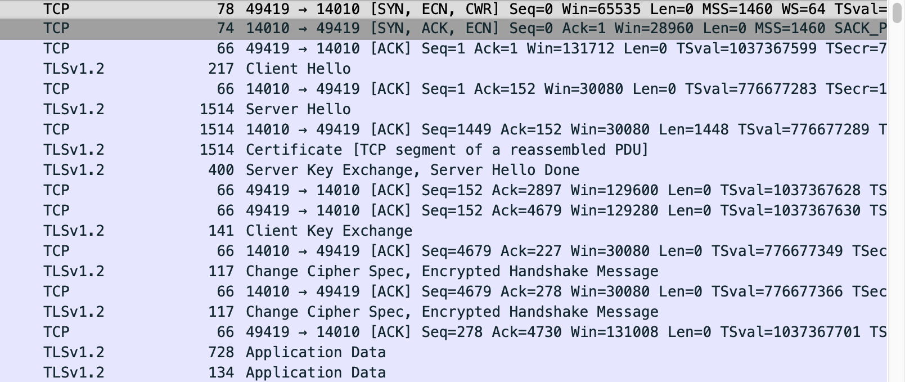
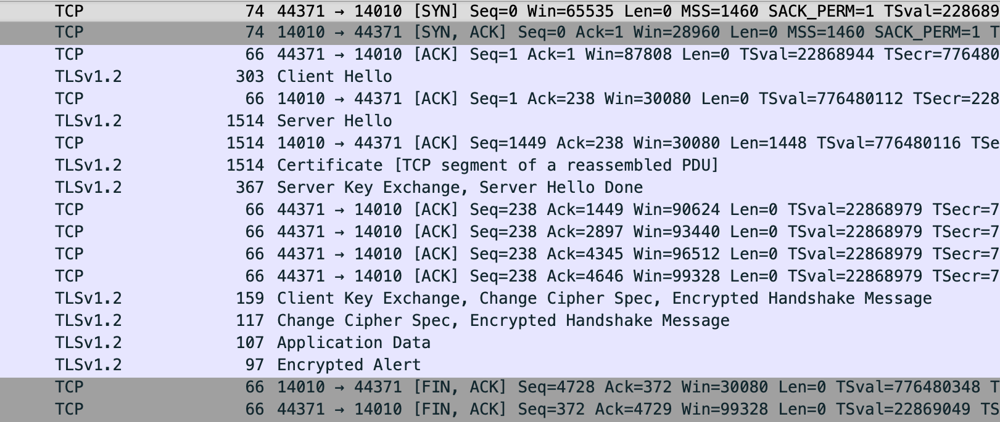

### 前言
处于安全性考虑，上周要在直播App的弹幕服务上添加TLS加密，我大概看了一下聊天服务的实现，是基于AndroidAsync这一SDK来实现的。那么按照网上搜索的文档来处理就可以了，偏偏这个库关于TLS Socket的文章还挺少。改TLS加密倒是挺快，但调试是有点费劲，花了不少时间，在这里记录一下坑点好了。


### 认证配置
这一步主要是配置KeyStore、TraustManager、KeyManager等工具用以初始化SSLContext。  
直接用代码讲解会比较清楚，
```Java
// 配置KeyStore对象，加载包含证书的KeyStore
InputStream is = context.getResources().openRawResource(R.raw.crt_pub);
KeyStore keyStore = KeyStore.getInstance("BKS");
char[] password = "123456".toCharArray();
keyStore.load(is, password);

// 初始化TrustManager
TrustManagerFactory tmf = TrustManagerFactory.getInstance("X509");
tmf.init(keyStore);
TrustManager[] trustManagers = tmf.getTrustManagers();

// 初始化KeyManager，双向认证时使用
// KeyManagerFactory kmf = KeyManagerFactory.getInstance("X509")
// kmf.init(keyStore);
// KeyManager[] keyManagers = kmf.getKeyManagers();

SSLContext sslContext = SSLContext.getInstance("TLS");
// 单向认证只需要TrustManager
sslContext.init(null, trustManagers, null);
// 双向认证需要传入KeyManager
// sslContext.init(keyManagers, trustManagers, null);
```
__KeyStore__ 对象有手动加载crt证书和直接加载KeyStore两种方式来生成，Android仅支持BKS格式的KeyStore，如果使用KeyStore来存储证书的话，记得转换一下格式。  
__单向认证__ 通常是客户端来校验服务端下发证书的合法性，在Java/Android中，校验服务端下发证书合法性这一块逻辑主要由```TrustManager```负责，因此这个东西是必须初始化的。  
__双向认证__ 则需初始化KeyManager，在SSLContext的init方法中国呢传入，由于我是做单向验证，这一步就不细说了。


### SSL socket建立
在无需建立SSL时，AndroidAsync框架建立一条socket链接是这样写的
```Java
AsyncServer.getDefault().connectSocket(host, port, new ConnectCallback() {

    @Override
    public void onConnectCompleted(Exception ex, final AsyncSocket socket) {
        if (ex != null) {
            // handle exception
            return;
        }
        // do somthing on connection completed
    }

});
```
建立SSL socket也比较简单，就是在上述代码上利用```AsyncSSLSocketWrapper```添加一个证书交换的握手过程
```Java
AsyncServer.getDefault().connectSocket(host, port, new ConnectCallback() {

    @Override
    public void onConnectCompleted(Exception ex, final AsyncSocket socket) {
        if (ex != null) {
            // handle exception
            return;
        }
        handleSSLhandshake(host, port, socket, new AsyncSSLSocketWrapper.HandshakeCallback {
        public void onHandshakeCompleted(Exception e, AsyncSSLSocket sslSocket);
            // 重中之重这里的回调，onHandshakeCompleted只代表握手过程结束，并不代表SSL socket真正建立
            // 如果在这里立刻调用socket写数据，可能会导致服务端发出警告并关闭socket
            // 这里可以做设置socket回调等操作，但别写数据
            if (e != null) {
                // handle exception
                return;
            }
            // 设置回调监听什么socket是否可写数据
            sslSocket.setWriteableCallback(new WritableCallback() {
                @Override
                public void onWriteable() {
                    // 当收到此回调时才代表SSLsocket完全建立
                    // do somthing on connection completed
                    ......
                }
            });
        });
    }
});

......

private void handleSSLhandshake(String host, AsyncSocket socket, AsyncSSLSocketWrapper.HandshakeCallback callback) {
    // KeyStore、TrustManager、KeyManager、SSLContext等实例的初始化请参考上面的代码
    ......
    // sslContext来自上面认证配置生成的实例
    SSLEngine sslEngine = sslContext.createSSLEngine();
    HostNameVerifier allowAllVerifier = new HostNameVerifier() {
         @Override
        public boolean verify(String hostname, SSLSession session) {
            return true;
        }
    };
   AsyncSSLSocketWrapper.handshake(
        socket,
        host,
        port,
        sslEngine,
        trustManagers,
        allowAllVerifier,
        true,
        callback
    ); 
}
```
看到我在SSL握手那段备注了一大堆了么，都是血泪教训啊😂  
下面的内容是调试记录，读者有兴趣的话可以继续往下看看

### 踩坑记录
最开始我直接将socket建立之后的工作（一些数据上报）内容直接挪到了```onHandshakeCompleted()```回调中，运行起来看着很正常，onHandshakeCompleted成功回调，该执行的都执行了，socket的状态也是连着的，但是收不到数据，也发不出数据。  
这就很莫名其妙了，无奈，先找后端老哥帮忙查一下，结果后端老哥说没有连接记录，啥数据都没有。  
......  
看来只能借助于WireShark了  
WireShark抓包了一个连接正常的iPhone，和连接异常的Android，看看handshake过程有什么区别

iOS 正常过程  
  

Android 异常过程
  

我怀疑问题就出在这个Encrypted Alert上面，在服务端回复这个之后，socket就断掉了，而这个Encrypted Alert上面，紧接着的是一条客户端发送的Application Data包，得找出这个包是谁发的才行。  
然而追踪AndroidAsync源码下来，服务端居然是回复了handshake finish的，也就是说SSL验证过程是没问题的……
调试过程中我发现了AsyncSocket上有个setOnWriteableCallback这个方法，之前的代码并没有设置这个回调，遂搜索一下这个回调是干什么用的。然而并没有什么文章，倒是搜到一份github源码

[AndroidAsyncSocketExamples - ClientSSL.java](https://github.com/reneweb/AndroidAsyncSocketExamples/blob/master/app/src/main/java/com/github/reneweb/androidasyncsocketexamples/tcp/ClientSSL.java)

```Java
socket.setWriteableCallback(new WritableCallback() {
    @Override
    public void onWriteable() {
        Util.writeAll(socket, "Hello Server".getBytes(), new CompletedCallback() {
            @Override
            public void onCompleted(Exception ex) {
                if (ex != null) throw new RuntimeException(ex);
                System.out.println("[Client] Successfully wrote message");
            }
        });
    }
});
```
我注意到一点，这个Demo是在```onWriteable()```回调之后才向socket写数据的，那就这么改试试吧。  

然后就成功了……

……

这什么回调套路啊，坑爹啊……
